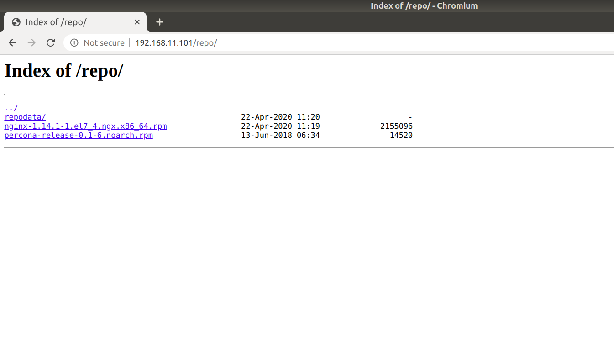

**1. Создать свой RPM (можно взять свое приложение, либо собрать к примеру апач с определенными опциями)**

Для сборки RPM-пакета необходимо установить следующие пакеты:
`redhat-lsb-core wget rpmdevtools rpm-build createrepo yum-utils`

Будем собирать пакет `NGINX` с модулем `openssl`.

Скачаем `SRPM` пакет `NGINX` и установим его:
```
[vagrant@rpmmachine ~]$ wget https://nginx.org/packages/centos/7/SRPMS/nginx-1.14.1-1.el7_4.ngx.src.rpm
[vagrant@rpmmachine ~]$ rpm -i nginx-1.14.1-1.el7_4.ngx.src.rpm
```
После этого в домашней директории создастся дерево каталогов для сборки:
```
[vagrant@rpmmachine ~]$ tree rpmbuild/
rpmbuild/
├── SOURCES
│   ├── COPYRIGHT
│   ├── logrotate
│   ├── nginx-1.14.1.tar.gz
│   ├── nginx.check-reload.sh
│   ├── nginx.conf
│   ├── nginx-debug.service
│   ├── nginx-debug.sysconf
│   ├── nginx.init.in
│   ├── nginx.service
│   ├── nginx.suse.logrotate
│   ├── nginx.sysconf
│   ├── nginx.upgrade.sh
│   └── nginx.vh.default.conf
└── SPECS
    └── nginx.spec
```
Также скачаем и разархивируем последние исходники для `openssl`:
```
[vagrant@rpmmachine ~]$ wget https://www.openssl.org/source/latest.tar.gz && tar -xvf latest.tar.gz
```
С помощью `yum-builddep` установим все зависимости, необходимые для сборки:
```
[vagrant@rpmmachine ~]$ sudo yum-builddep -y rpmbuild/SPECS/nginx.spec 
```
Далее отредактируем `spec` файл, добавив в секцию `%build` строку `--with-openssl=/home/vagrant/openssl-1.1.1g`.

Теперь соберем сам пакет:
```
[vagrant@rpmmachine ~]$ rpmbuild -bb rpmbuild/SPECS/nginx.spec 
```
Готовый rpm-пакет будет расположен в `rpmbuild/RPMS/x86_64/`:
```
[vagrant@rpmmachine ~]$ ll rpmbuild/RPMS/x86_64/
total 4580
-rw-rw-r--. 1 vagrant vagrant 2155096 апр 21 14:27 nginx-1.14.1-1.el7_4.ngx.x86_64.rpm
-rw-rw-r--. 1 vagrant vagrant 2528208 апр 21 14:27 nginx-debuginfo-1.14.1-1.el7_4.ngx.x86_64.rpm
```
Установим собранный пакет и убедимся, что `NGINX` работает:
```
[vagrant@rpmmachine ~]$ sudo yum localinstall -y rpmbuild/RPMS/x86_64/nginx-1.14.1-1.el7_4.ngx.x86_64.rpm 
[vagrant@rpmmachine ~]$ sudo systemctl start nginx && sudo systemctl status nginx
● nginx.service - nginx - high performance web server
   Loaded: loaded (/usr/lib/systemd/system/nginx.service; disabled; vendor preset: disabled)
   Active: active (running) since Вт 2020-04-21 14:34:43 UTC; 85ms ago
     Docs: http://nginx.org/en/docs/
  Process: 18069 ExecStart=/usr/sbin/nginx -c /etc/nginx/nginx.conf (code=exited, status=0/SUCCESS)
 Main PID: 18070 (nginx)
   CGroup: /system.slice/nginx.service
           ├─18070 nginx: master process /usr/sbin/nginx -c /etc/nginx/nginx.conf
           └─18071 nginx: worker process

апр 21 14:34:43 rpmmachine systemd[1]: Starting nginx - high performance web server...
апр 21 14:34:43 rpmmachine systemd[1]: Started nginx - high performance web server.
```
Далее будем использовать `NGINX` для доступа к собственному репозиторию.

**2. Создать свой репозиторий и разместить там свой RPM**

В дирректории для статического контента `NGINX` создадим каталог `repo`, который будет являться каталогом для нашего репозитория, и скопируем туда наш RPM-пакет:
```
[vagrant@rpmmachine ~]$ sudo mkdir /usr/share/nginx/html/repo
[vagrant@rpmmachine ~]$ sudo cp rpmbuild/RPMS/x86_64/nginx-1.14.1-1.el7_4.ngx.x86_64.rpm /usr/share/nginx/html/repo/
```
Дополнительно скачаем RPM пакет Percona-Server, который установим из нашего репозитория:
```
[vagrant@rpmmachine ~]$ sudo wget http://www.percona.com/downloads/percona-release/redhat/0.1-6/percona-release-0.1-6.noarch.rpm -O /usr/share/nginx/html/repo/percona-release-0.1-6.noarch.rpm
```
Инициализируем репозиторий:
```
[vagrant@rpmmachine ~]$ sudo createrepo /usr/share/nginx/html/repo/
Spawning worker 0 with 1 pkgs
Spawning worker 1 with 1 pkgs
Workers Finished
Saving Primary metadata
Saving file lists metadata
Saving other metadata
Generating sqlite DBs
Sqlite DBs complete
```
Для доступа к листингу директории со статическим контентом добавим директиву `autoindex on` в `location` в дефолтном конфиге `NGINX` (`/etc/nginx/conf.d/default.conf`):
```
location / {
    root   /usr/share/nginx/html;
    index  index.html index.htm;
    autoindex on;
}
```
Проверяем синтаксис и перечитываем конфиг:
```
[vagrant@rpmmachine ~]$ sudo nginx -t && sudo nginx -s reload
nginx: the configuration file /etc/nginx/nginx.conf syntax is ok
nginx: configuration file /etc/nginx/nginx.conf test is successful
```
Проверим, как это отображается в браузере:



Создадим `.repo` файл с информацией о нашем репозитории в `/etc/yum.repos.d`:
```
[vagrant@rpmmachine ~]$ sudo -i
[root@rpmmachine ~]# cat >> /etc/yum.repos.d/otus.repo << EOF
> [otus]
> name=otus-linux
> baseurl=http://127.0.0.1/repo
> gpgcheck=0
> enabled=1
> EOF
[root@rpmmachine ~]# logout
```
Просмотрим репозиторий:
```
[vagrant@rpmmachine ~]$ yum repolist enabled | grep otus
otus                                otus-linux                   
```
Установим Percona из нашего репозитория:
```
[vagrant@rpmmachine ~]$ sudo yum install percona-release -y
Loaded plugins: fastestmirror
Loading mirror speeds from cached hostfile
 * base: mirror.axelname.ru
 * extras: mirror.axelname.ru
 * updates: mirror.axelname.ru
otus                                                                                                                | 2.9 kB  00:00:00     
otus/primary_db                                                                                                     | 3.3 kB  00:00:00     
Resolving Dependencies
--> Running transaction check
---> Package percona-release.noarch 0:0.1-6 will be installed
--> Finished Dependency Resolution

Dependencies Resolved

=====================================================================================================================================
 Package                        Arch                         Version                     Repository                    Size
=====================================================================================================================================
Installing:
 percona-release                noarch                        0.1-6                      otus                          14 k

Transaction Summary
=====================================================================================================================================
Install  1 Package

Total download size: 14 k
Installed size: 16 k
Downloading packages:
percona-release-0.1-6.noarch.rpm                                                                                    |  14 kB  00:00:00     
Running transaction check
Running transaction test
Transaction test succeeded
Running transaction
  Installing : percona-release-0.1-6.noarch                                                                                            1/1 
  Verifying  : percona-release-0.1-6.noarch                                                                                            1/1 

Installed:
  percona-release.noarch 0:0.1-6                                                                                                           

Complete!
```
***Для проверки задания выполнить `vagrant up`, открыть в браузере (или curl'ом) http://192.168.11.101/repo/, далее `vagrant ssh` и установить Percona `sudo yum install percona-release -y`.***

**3. Задание \*: реализовать дополнительно пакет через docker**

Реализована сборка rpm-пакета `NGINX` с модулем `openssl`, а также создание репозитория. Для проверки выполнить команду `docker run -d -p 80:80 --name nginxrpm vasiilij/nginxrpm:1.0` и пройти в браузере на страницу `http://localhost/repo/`
